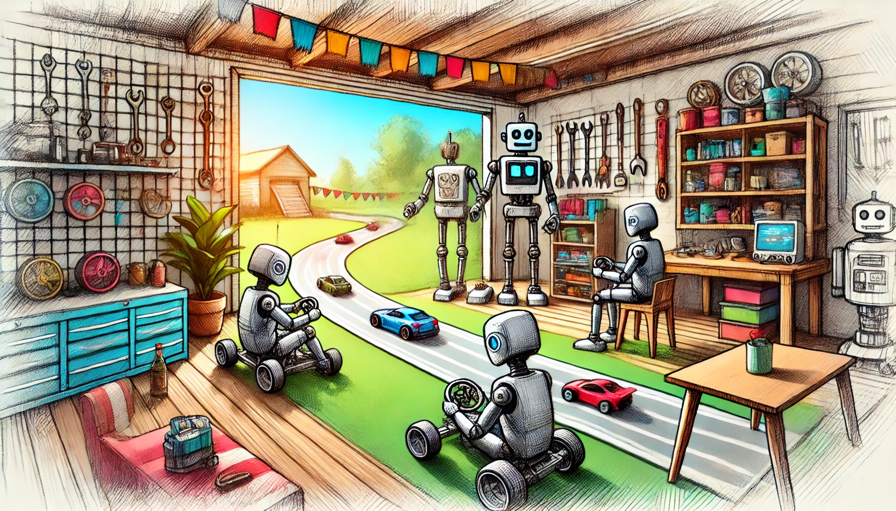

# LLM Engineering: Master AI & Large Language Models (LLMs)  
### Ed Donner on Udemy  

---

In this repository, you will find my Jupyter Notebooks for the projects I completed during the course *LLM Engineering: Master AI & Large Language Models (LLMs)* by Ed Donner on Udemy. This course provides a broad overview of the world of Large Language Models (LLMs) and their applications, equipping participants with practical skills to tackle real-world challenges in AI.  

---

## Course Content  
The course spans **8 weeks** and is structured to progressively build your expertise in LLM engineering:

### **Week 1: Introduction to AI and LLMs**  
- Overview of Artificial Intelligence and Natural Language Processing (NLP).  
- Fundamental principles behind Large Language Models.  
- Popular LLMs (e.g., GPT, BERT) and their applications.  

### **Week 2: Language Model Fundamentals**  
- Tokenization, embeddings, and transformers.  
- Attention mechanisms in LLMs.  
- Understanding model architectures like GPT and BERT.  

### **Week 3: Building and Fine-Tuning LLMs**  
- Basics of training LLMs on custom datasets.  
- Fine-tuning pre-trained LLMs for specific tasks.  
- Optimization techniques for LLM training.  

### **Week 4: Deployment and Inference**  
- Deploying LLMs in production environments.  
- Scaling and optimizing LLMs for performance.  
- Building APIs for LLM-based applications.  

### **Week 5: Prompt Engineering**  
- Crafting effective prompts for language models.  
- Techniques for improving model responses.  
- Advanced prompt engineering strategies for complex tasks.  

### **Week 6: Advanced Applications of LLMs**  
- Implementing LLMs in chatbots, summarization, and translation.  
- Custom AI tools powered by LLMs.  
- Addressing ethical concerns in LLM deployment.  

### **Week 7: Troubleshooting and Debugging LLMs**  
- Common challenges in LLM engineering.  
- Debugging model outputs and performance issues.  
- Case studies and solutions for real-world problems.  

### **Week 8: Capstone Project**  
- Applying course knowledge to build an end-to-end LLM-powered application.  
- Presentation and evaluation of the project.  
- Preparing for AI industry roles and certifications.  

---

## License  
Feel free to use, modify, and share the code and projects in this repository for educational and personal purposes.  

However, please give appropriate credit when sharing or referencing this work. Redistribution of substantial parts of the code as part of a commercial product is not permitted without explicit permission.
